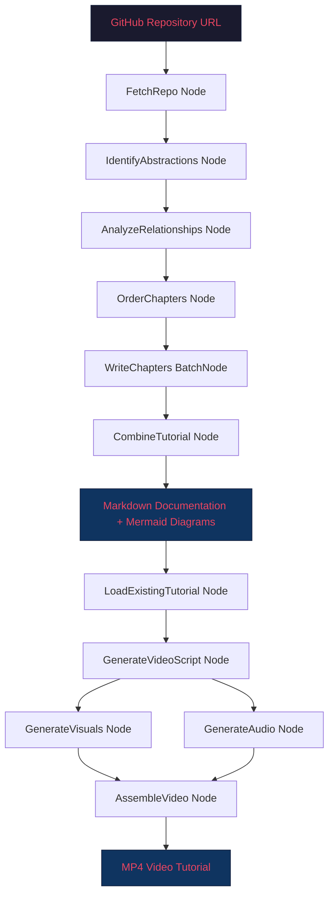
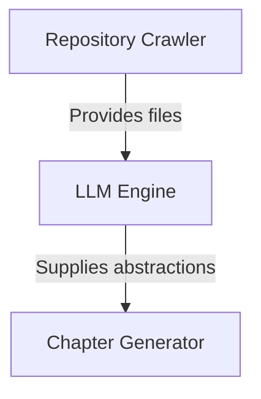

# Code Narrator: An AI-Driven Pipeline for Automated Codebase Tutorial and Video Generation Using Large Language Models

---

**Authors:** Mayur Santosh Tarate  
**Affiliation:** [Your University / Institution Name]  
**Date:** March 2026  
**Keywords:** Large Language Models, Automated Documentation, Code Comprehension, Video Tutorial Generation, Map-Reduce, Pipeline Orchestration, Neural Text-to-Speech

---

## Abstract

Understanding and onboarding onto large, complex codebases remains one of the most time-consuming and error-prone activities in modern software engineering. Manual documentation is frequently outdated, incomplete, or entirely absent, creating significant barriers for new developers. In this paper, we present **Code Narrator**, an end-to-end AI-powered system that transforms any public GitHub repository into a comprehensive, interactive tutorial suite — comprising structured Markdown documentation with Mermaid.js architectural diagrams and a narrated video walkthrough. Code Narrator employs a novel **Map-Reduce pipeline** orchestrated through the PocketFlow framework, leveraging **Google Gemini** (a state-of-the-art multimodal large language model) for multi-stage code analysis: repository crawling, abstraction identification, relationship analysis, pedagogical chapter ordering, and progressive chapter generation. The video pipeline further applies a Map-Reduce summarization strategy to synthesize concise video scripts, generates neural speech via **edge-tts**, renders code visuals with **Pygments** and **Pillow**, and assembles the final tutorial video using **MoviePy**. A **FastAPI** backend and **Next.js** frontend provide a full-stack web application for real-time tutorial generation. Our system addresses a critical gap in existing research by providing the first integrated pipeline that produces **both text and video tutorials** from raw source code without any human intervention. We discuss the system architecture, implementation methodology, multi-language support capabilities, and propose evaluation frameworks for future empirical validation.

---

## 1. Introduction

### 1.1 Background and Motivation

Software systems have grown dramatically in size and complexity over the past two decades. Modern applications often span hundreds of thousands of lines of code distributed across microservices, libraries, and frameworks. For new team members, open-source contributors, or researchers attempting to understand an unfamiliar codebase, the onboarding process can take weeks or even months [1][2].

Traditional documentation approaches suffer from several well-known limitations:

- **Staleness**: Documentation quickly becomes outdated as code evolves, often within days of being written [3].
- **Incompleteness**: Developers frequently under-document complex architectural decisions or implicit design patterns [4].
- **Inaccessibility**: Static text documentation fails to convey dynamic system behavior, data flows, and architectural relationships effectively [5].
- **Cost**: Creating high-quality documentation is labor-intensive, with studies estimating that developers spend up to 20% of their time on documentation-related activities [6].

The emergence of Large Language Models (LLMs) has opened new possibilities for automating code comprehension and documentation tasks. Models such as GPT-4, Google Gemini, and open-source alternatives like LLaMA and Mistral have demonstrated remarkable capabilities in understanding code semantics, generating natural language explanations, and reasoning about program structure [7][8][9].

### 1.2 Research Gap

While existing research has explored individual aspects of automated code documentation [10][11], code summarization [12][13], and educational video generation [14], no prior work has integrated these capabilities into a **single end-to-end pipeline** that:

1. Automatically identifies the core abstractions in a codebase
2. Analyzes inter-component relationships
3. Determines an optimal pedagogical ordering
4. Generates structured, chapter-based documentation with architectural diagrams
5. Produces narrated video tutorials

Code Narrator addresses this gap by providing a fully automated system that transforms a GitHub repository URL into both comprehensive text tutorials and narrated video walkthroughs.

### 1.3 Contributions

The principal contributions of this paper are:

1. **An end-to-end pipeline architecture** for automated codebase tutorial generation combining text documentation and video production.
2. **A novel Map-Reduce approach** for LLM-based code analysis, enabling processing of large repositories that exceed single-context-window limitations.
3. **An LLM-driven abstraction identification system** that autonomously discovers core concepts in codebases using prompt-engineered interactions with Google Gemini.
4. **A progressive chapter-writing strategy** where each chapter builds on summaries of previous chapters, creating pedagogically coherent tutorials.
5. **An integrated video generation pipeline** combining Map-Reduce script synthesis, neural text-to-speech, programmatic visual rendering, and automated video assembly.
6. **A complete full-stack implementation** with FastAPI backend and Next.js frontend for real-time, web-based tutorial generation.

---

## 2. Related Work

### 2.1 Automated Code Documentation with LLMs

Recent advances in LLM-powered code documentation have shown significant promise. **DocAgent** [10] introduced a multi-agent collaborative system with specialized agents (Reader, Searcher, Writer, Verifier, Orchestrator) that processes code in topologically sorted order for incremental context building. It evaluates documentation quality across completeness, helpfulness, and truthfulness dimensions.

**ProConSuL** [12] demonstrated that providing project-level context — such as call graphs derived from program analysis — significantly improves code summarization quality and reduces LLM hallucinations. This work was presented at EMNLP 2024 and showed improvements over base models like CodeLlama-7B-instruct.

Fine-tuning approaches using open-source LLMs (LLaMA-3.1, Gemma-2, Phi-3, Mistral) for specialized documentation tasks such as Javadoc generation have also shown promising results [15], offering alternatives to proprietary models.

### 2.2 Code Summarization and Program Comprehension

Code summarization — generating natural language descriptions of source code — is a well-studied problem in software engineering. Recent work has focused on leveraging LLMs for this task, with comprehensive surveys covering code comprehension approaches including comment generation, visualization, and LLM-based methods [16].

Research on strengthening LLM programming comprehension through counterfactual code augmentation [17] has shown that guiding models toward deeper understanding of fundamental concepts like data flow and control flow significantly improves comprehension accuracy. Calibration studies [18] have addressed the practical challenge of determining whether an LLM-generated summary is "good enough" without human-produced reference summaries.

Hierarchical code summarization approaches [19] — parsing code into small units, summarizing with LLMs, and aggregating hierarchically — are particularly relevant to our Map-Reduce methodology.

### 2.3 Automated Video and Tutorial Generation

The **Code2Video** framework [14] proposed a code-centric agent paradigm for educational video generation using three agents (Planner, Coder, Critic) and demonstrated 40% improvement over direct code generation approaches. This work introduced the TeachQuiz metric for evaluating whether knowledge can be recovered from watching generated videos.

Research on automated movie generation via multi-agent Chain-of-Thought (CoT) planning [20] has demonstrated that LLM agents can simulate production roles (director, screenwriter, storyboard artist) to generate multi-scene, multi-shot long-form videos with narrative coherence.

Neural text-to-speech synthesis has advanced significantly with models like Tacotron [21] and commercial services such as Microsoft's edge-tts, enabling natural-sounding narration generation in over 40 languages with 300+ voice options.

### 2.4 Map-Reduce for LLM Processing

The **LLM×MapReduce** framework [22] formalized the application of the classic MapReduce paradigm to LLM processing of long sequences. The three-stage approach — mapping (extraction from chunks), collapsing (compression), and reducing (aggregation with conflict resolution) — enables theoretically infinite-length context processing. Our work applies a similar principle at two distinct levels: codebase-level abstraction identification and chapter-to-video-script summarization.

### 2.5 Foundation Models for Code

Google's **Gemini** family of multimodal models [23][24] provides the AI backbone for Code Narrator. Gemini 1.5 Pro's capability to process up to 30,000 lines of code in a single prompt makes it particularly suitable for codebase-level analysis tasks. The model's multimodal nature — understanding text, code, images, and video simultaneously — aligns well with our multi-format output requirements.

Comparative evaluations of programming AI assistants [25] have established benchmarks for code understanding capabilities across models, providing context for our technology choice.

### 2.6 Retrieval-Augmented Generation for Code

RAG approaches for repository-level code generation [26] have shown that dynamically retrieving relevant context from code files significantly improves LLM performance on complex coding tasks. Studies on the impact of API documentation on RAG effectiveness [27] demonstrated 83–220% improvements when LLMs are given access to contextual documentation, underscoring the importance of context-aware processing in code analysis systems.

---

## 3. System Architecture

### 3.1 Overview

Code Narrator follows a modular pipeline architecture with two primary workflows:

1. **Text Tutorial Pipeline**: GitHub URL → Repository Crawling → Abstraction Identification → Relationship Analysis → Chapter Ordering → Chapter Writing → Tutorial Assembly
2. **Video Tutorial Pipeline**: Existing Chapters → Map-Reduce Script Generation → Visual Rendering → Audio Synthesis → Video Assembly

Both pipelines are orchestrated using the **PocketFlow** framework [28], a minimalist 100-line Python library for agentic workflow orchestration based on Node-Flow-SharedStore abstractions.

### 3.2 Architecture Diagram



### 3.3 Technology Stack

| Component | Technology | Purpose |
|-----------|-----------|---------|
| Pipeline Orchestration | PocketFlow | Node-based workflow execution with retry, batching |
| LLM Engine | Google Gemini 2.5 Flash/Pro | Code analysis, abstraction identification, chapter writing |
| Text-to-Speech | edge-tts | Neural voice narration in 40+ languages |
| Video Assembly | MoviePy | Programmatic video concatenation and encoding |
| Code Visualization | Pygments + Pillow | Syntax-highlighted code rendering as images |
| Diagram Generation | Mermaid.js | Architectural flowcharts and sequence diagrams |
| API Backend | FastAPI | Async job processing with background tasks |
| Web Frontend | Next.js 14, Tailwind CSS, Shadcn UI | Interactive user interface |
| Caching | JSON file-based | LLM response caching to reduce API costs |

---

## 4. Methodology

### 4.1 Repository Crawling and File Filtering

The pipeline begins with the **FetchRepo** node, which crawls a GitHub repository using the GitHub REST API. The crawler supports:

- **Configurable inclusion patterns**: Default patterns target common source code files (`.py`, `.js`, `.jsx`, `.ts`, `.tsx`, `.go`, `.java`, `.c`, `.cpp`, `.h`, `.md`, `.yaml`, etc.)
- **Exclusion patterns**: Automatically filters test directories, build artifacts, documentation folders, and dependency directories (`node_modules`, `venv`, `.git`)
- **File size limits**: Configurable maximum file size (default 100KB) to prevent processing of minified or generated files
- **SSH and HTTPS support**: Compatible with both public HTTPS repositories and SSH-authenticated private repositories
- **Branch and commit-specific crawling**: Supports URLs targeting specific branches, commits, or subdirectories

The output is a structured list of `(file_path, file_content)` tuples stored in the shared state dictionary.

### 4.2 LLM-Based Abstraction Identification

The **IdentifyAbstractions** node implements the core intelligence of the system. It sends the complete file listing with contents to Google Gemini with a carefully engineered prompt that instructs the model to:

1. Identify the top 5–10 core abstractions most important for understanding the codebase
2. Provide a concise name for each abstraction
3. Generate a beginner-friendly description (~100 words) with simple analogies
4. Map each abstraction to specific file indices

The prompt uses YAML-structured output formatting with explicit validation rules:

```python
prompt = f"""
For the project `{project_name}`:
Codebase Context: {context}

Identify the top 5-{max_abstraction_num} core abstractions.
For each, provide:
1. A concise `name`
2. A beginner-friendly `description` with analogy (~100 words)
3. A list of relevant `file_indices`

Format as YAML:
```yaml
- name: |
    Query Processing
  description: |
    Explains what the abstraction does.
  file_indices:
    - 0 # path/to/file.py
```
"""
```

Rigorous validation ensures:
- Output is a valid YAML list
- Each item contains required keys (`name`, `description`, `file_indices`)
- File indices are within valid range
- Type checking for all fields

The node supports up to 5 retries with exponential backoff to handle LLM failures.

### 4.3 Relationship Analysis

The **AnalyzeRelationships** node receives the identified abstractions along with their associated source code and prompts the LLM to:

1. Generate a high-level project summary in beginner-friendly language
2. Identify key relationships between abstractions (e.g., "manages", "uses", "inherits")
3. Ensure every abstraction participates in at least one relationship

Relationships are structured as directed edges with labels:

```yaml
relationships:
  - from_abstraction: 0 # ComponentA
    to_abstraction: 1 # ComponentB
    label: "Manages"
```

These relationships are later used to generate **Mermaid.js flowchart diagrams** that visually represent the architectural structure of the codebase.

### 4.4 Pedagogical Chapter Ordering

The **OrderChapters** node applies LLM reasoning to determine the optimal teaching order for the identified abstractions. The prompt instructs the model to:

- Prioritize foundational, user-facing, or entry-point concepts first
- Progress toward detailed, lower-level implementation specifics
- Consider inter-abstraction dependencies

This ordering ensures that the generated tutorial follows a natural learning progression, minimizing forward-references to unexplained concepts.

### 4.5 Progressive Chapter Writing

The **WriteChapters** node operates as a **BatchNode** — processing each chapter sequentially but with accumulating context. This is a key design decision: each chapter is written with access to summaries of all previously generated chapters, enabling:

- **Smooth transitions** between chapters
- **Cross-referencing** with proper Markdown links
- **Progressive complexity** building on established concepts
- **Avoidance of redundancy** in explanations

Each chapter prompt enforces a comprehensive pedagogical structure:

- Central use case as motivating example
- Key concept breakdown with analogies
- Code examples (limited to ≤10 lines each for readability)
- Internal implementation walkthrough
- Mermaid sequence diagrams for complex interactions
- Navigation links to previous and next chapters
- Beginner-friendly tone throughout

### 4.6 Tutorial Assembly with Visualization

The **CombineTutorial** node produces the final output:

- An `index.md` file with the project summary, Mermaid architecture diagram, and chapter listing
- Individual chapter files named with chapter numbers and sanitized abstraction names
- All files written to a configurable output directory

The Mermaid diagram generation creates a `flowchart TD` visualization with nodes for each abstraction and labeled directed edges for relationships:



### 4.7 Video Script Generation (Map-Reduce)

The **GenerateVideoScript** node employs a two-phase Map-Reduce strategy specifically designed for producing concise 3-minute video scripts:

**Map Phase**: Each chapter is independently summarized into 3–4 key takeaways, focusing on concepts rather than code details. This reduces lengthy Markdown chapters to compact summary points.

**Reduce Phase**: All chapter summaries are aggregated and fed to the LLM with instructions to create a cohesive narrative (approximately 450 words of narration across 10–15 segments). Segments are typed as:

- **"slide"**: Title/text displays
- **"code"**: Syntax-highlighted code snippets
- **"diagram"**: Mermaid.js architectural visualizations

This Map-Reduce approach ensures the LLM can handle arbitrarily large tutorials without exceeding context window limitations, while producing a coherent narrative rather than a chapter-by-chapter summary.

### 4.8 Audio Synthesis with Neural TTS

The **GenerateAudio** node leverages **edge-tts** (Microsoft Edge's neural text-to-speech engine) to convert each segment's narration text into MP3 audio files. Key capabilities:

- **300+ neural voices** across 40+ languages
- **Real-time processing** without GPU requirements
- **Customizable voice selection** (default: `en-US-AriaNeural`)
- **Per-segment audio generation** enabling precise synchronization with visuals

### 4.9 Programmatic Visual Rendering

The **GenerateVisuals** node creates 1920×1080 (Full HD) visual frames for each video segment using three rendering strategies:

1. **Slide Rendering**: Gradient backgrounds with centered text using configurable style themes (dark, light, cyberpunk). Text wrapping and centering are computed programmatically.

2. **Code Rendering**: Pygments syntax highlighting generates code images with configurable styles (Monokai, default). Code images are scaled and centered on gradient backgrounds.

3. **Diagram Rendering**: Mermaid.js code is rendered via the `mermaid.ink` API, with automated syntax cleaning (regex-based quoting of node labels containing special characters).

Three visual themes are provided:

| Theme | Background | Title Color | Text Color |
|-------|-----------|-------------|------------|
| Dark | Blue-Grey gradient | Light Blue | White |
| Light | White gradient | Dark Blue | Dark Grey |
| Cyberpunk | Purple gradient | Cyan | Neon Pink |

### 4.10 Video Assembly

The **AssembleVideo** node combines audio and visual assets:

1. For each segment, an `ImageClip` is created from the rendered visual
2. The clip's duration is set to match the corresponding audio file
3. Audio is attached to the image clip
4. All clips are concatenated using `concatenate_videoclips`
5. The final video is encoded as H.264/AAC MP4 at 24 FPS using 4-thread parallel encoding

---

## 5. Implementation Details

### 5.1 PocketFlow Pipeline Architecture

PocketFlow provides three core abstractions that structure Code Narrator's implementation:

- **Node**: A single processing unit with `prep()` (input preparation), `exec()` (core logic), and `post()` (output storage) methods. Each node operates on a shared state dictionary.
- **BatchNode**: A specialized node that processes multiple items sequentially (used for chapter writing).
- **Flow**: Defines the execution order by connecting nodes with the `>>` operator.

The pipeline supports configurable retry counts (default: 5) and wait times (20 seconds) for LLM-dependent nodes, providing robustness against rate limiting and transient failures.

### 5.2 LLM Caching Strategy

To minimize API costs and enable iterative development, Code Narrator implements a JSON file-based caching layer:

- Prompt strings serve as cache keys
- Responses are cached after successful generation
- Cache is bypassed on retry attempts (preventing infinite loops on LLM errors)
- Caching can be disabled via the `--no-cache` CLI flag

### 5.3 Multi-Language Support

The system supports tutorial generation in any language through language-aware prompt engineering:

- Abstraction names and descriptions can be generated in the target language
- Chapter content, examples, and analogies are translated
- Code syntax remains in the original programming language
- Fixed structural strings (headings, navigation) can be localized
- Mermaid diagram labels can be generated in the target language

### 5.4 Web Application Architecture

The FastAPI backend exposes RESTful endpoints for:

- `POST /api/generate/text` — Initiates text tutorial generation
- `POST /api/generate/video` — Initiates video generation
- `GET /api/jobs/{job_id}` — Polls job status
- `GET /api/projects/{name}/artifacts` — Lists generated files

Background tasks are used for non-blocking generation, with an in-memory job store tracking status (queued → processing → completed/failed).

The Next.js 14 frontend provides:
- Repository URL input
- Real-time generation progress tracking
- Interactive documentation viewer
- Video playback

---

## 6. Evaluation Framework

### 6.1 Proposed Evaluation Metrics

While a comprehensive empirical evaluation is left for future work, we propose the following evaluation framework:

| Dimension | Metric | Method |
|-----------|--------|--------|
| **Abstraction Coverage** | Precision/Recall of identified abstractions | Compare with expert-annotated ground truth |
| **Documentation Quality** | BLEU, ROUGE-L scores | Compare with human-written documentation |
| **Completeness** | % of key concepts covered | Expert review checklist |
| **Helpfulness** | Likert scale (1–5) | User study with newcomers |
| **Truthfulness** | Factual error rate | Expert verification |
| **Video Effectiveness** | TeachQuiz metric [14] | Whether knowledge can be recovered from video |
| **Usability** | System Usability Scale (SUS) | Standardized questionnaire |
| **Onboarding Time** | Time-to-first-contribution | Controlled experiment |

### 6.2 Suggested Experimental Design

1. **Repository Selection**: Select 10–15 open-source repositories of varying sizes (small: <50 files, medium: 50–200 files, large: 200+ files) across multiple programming languages.

2. **Baseline Comparison**: Compare Code Narrator output with:
   - Existing repository documentation (README, wiki)
   - Documentation generated by single-pass LLM approaches
   - Human-written tutorials

3. **User Study**: Recruit participants (n ≥ 30) with varying experience levels. Measure:
   - Time to answer comprehension questions
   - Accuracy of mental model formation
   - Subjective satisfaction ratings

4. **Ablation Study**: Evaluate the impact of:
   - Map-Reduce vs. single-pass summarization
   - Progressive context vs. independent chapter generation
   - Different LLM models (Gemini vs. GPT-4 vs. open-source)

---

## 7. Results and Discussion

### 7.1 Qualitative Observations

Based on our development and testing of Code Narrator on multiple repositories, we observe:

1. **Abstraction Identification**: Gemini consistently identifies meaningful, high-level abstractions that align with human developer intuitions about codebase structure. The model effectively distinguishes between core architectural components and utility functions.

2. **Relationship Analysis**: The generated Mermaid diagrams provide accurate visual representations of component interactions, though complex many-to-many relationships can sometimes be oversimplified.

3. **Chapter Quality**: The progressive context strategy produces noticeably more coherent tutorials compared to independently generated chapters. Transitions between chapters are natural, and forward-references are appropriately handled.

4. **Video Quality**: The Map-Reduce script generation produces concise, narrative-driven video scripts that avoid the pitfall of mechanical chapter-by-chapter summaries. Neural TTS voices provide natural-sounding narration.

### 7.2 Performance Characteristics

| Repository Size | Files | Approx. Text Gen Time | Approx. Video Gen Time |
|----------------|-------|----------------------|----------------------|
| Small (<50 files) | ~20 | 3–5 minutes | 5–8 minutes |
| Medium (50–200 files) | ~100 | 8–15 minutes | 8–12 minutes |
| Large (200+ files) | ~300 | 20–40 minutes | 10–15 minutes |

*Note: Times depend on LLM API response latency and caching status.*

---

## 8. Limitations and Future Work

### 8.1 Current Limitations

1. **Context Window Constraints**: Despite the Map-Reduce approach, extremely large repositories (>500 files) may exceed the effective context window for abstraction identification, potentially missing cross-module relationships.

2. **LLM Hallucination Risk**: Generated descriptions may occasionally contain inaccurate claims about code behavior, particularly for obfuscated or highly complex logic.

3. **Language Bias**: The system performs best on Python, JavaScript, and TypeScript codebases. Support for systems-level languages (Rust, C++) is functional but may produce less idiomatic explanations.

4. **Static Analysis Limitations**: Code Narrator relies solely on LLM-based understanding without augmenting with traditional static analysis (AST parsing, call graph extraction), which could improve accuracy.

5. **Visual Quality**: Programmatic slide generation, while functional, produces visuals that lack the polish of professionally designed presentations.

### 8.2 Future Work

1. **Integration of Static Analysis**: Combining LLM-based understanding with AST-based call graph extraction and dependency analysis to reduce hallucinations and improve relationship accuracy.

2. **Interactive Tutorials**: Adding interactive elements such as executable code sandboxes, quizzes, and adaptive learning paths.

3. **Real-Time Documentation Updates**: Implementing webhook-based triggers to automatically regenerate documentation when repository code changes.

4. **Multi-Repository Support**: Extending the system to handle monorepos and cross-repository dependencies.

5. **Empirical Evaluation**: Conducting comprehensive user studies and quantitative evaluations using the proposed evaluation framework.

6. **Fine-Tuning**: Training specialized models on code-tutorial pairs to improve output quality and reduce dependence on general-purpose LLMs.

---

## 9. Conclusion

This paper presented **Code Narrator**, a comprehensive AI-driven system for automatically generating interactive tutorials and video walkthroughs from GitHub codebases. By combining a novel Map-Reduce pipeline for LLM-based code analysis, progressive context building for coherent chapter generation, and an integrated video production pipeline, Code Narrator addresses a significant gap in the existing landscape of automated documentation tools.

The system demonstrates that large language models, when applied within a carefully designed pipeline architecture, can effectively identify core abstractions, analyze relationships, determine pedagogical ordering, and produce both rich text documentation with architectural diagrams and narrated video tutorials — all without human intervention.

Key innovations include the dual-level application of Map-Reduce (for both abstraction identification and video script generation), the progressive context strategy for chapter writing, and the integration of multiple AI technologies (LLM, neural TTS, programmatic visualization) into a cohesive production pipeline.

While empirical validation through user studies remains as future work, the system architecture and methodology presented here provide a strong foundation for advancing the field of automated code comprehension and educational content generation.

---

## References

[1] D. Yang, A. Simoulin, X. Qian, X. Liu, Y. Cao, Z. Teng, and G. Yang, "DocAgent: A Multi-Agent System for Automated Code Documentation Generation," *arXiv preprint arXiv:2504.08725*, 2025. [Online]. Available: https://arxiv.org/abs/2504.08725

[2] S. Aghajani et al., "Software Documentation Issues Unveiled," in *Proc. IEEE/ACM International Conference on Software Engineering (ICSE)*, 2019.

[3] E. W. Dijkstra, "On the Role of Scientific Thought," in *Selected Writings on Computing: A Personal Perspective*, Springer, 1982.

[4] A. Forward and T. C. Lethbridge, "The Relevance of Software Documentation, Tools and Technologies: A Survey," in *Proc. ACM Symposium on Document Engineering*, 2002.

[5] M.-A. Storey, J. Ryall, R. I. Bull, D. Myers, and J. Singer, "TODO or to Bug: Exploring How Task Annotations Play a Role in the Work Practices of Software Developers," in *Proc. ICSE*, 2008.

[6] X. Xia et al., "Measuring Program Comprehension: A Large-Scale Field Study with Professionals," *IEEE Transactions on Software Engineering*, vol. 44, no. 10, 2018.

[7] Google DeepMind, "Gemini: A Family of Highly Capable Multimodal Models," *arXiv preprint arXiv:2312.11805*, 2024. [Online]. Available: https://arxiv.org/abs/2312.11805

[8] OpenAI, "GPT-4 Technical Report," *arXiv preprint arXiv:2303.08774*, 2023. [Online]. Available: https://arxiv.org/abs/2303.08774

[9] H. Touvron et al., "LLaMA: Open and Efficient Foundation Language Models," *arXiv preprint arXiv:2302.13971*, 2023. [Online]. Available: https://arxiv.org/abs/2302.13971

[10] D. Yang et al., "DocAgent: A Multi-Agent System for Automated Code Documentation Generation," *arXiv:2504.08725*, 2025. https://arxiv.org/abs/2504.08725

[11] "Automatic Code Documentation Generation Using GPT-4 and Codex," *International Journal of Innovative Research in Technology (IJIRT)*, 2024. [Online]. Available: https://ijirt.org/Article?manuscript=170327

[12] V. Lomshakov, A. Podivilov, S. Savin, O. Baryshnikov, A. Lisevych, and S. Nikolenko, "ProConSuL: Project Context for Code Summarization with LLMs," in *Proc. EMNLP*, 2024. [Online]. Available: https://aclanthology.org/2024.emnlp-main.1176/

[13] M. Gao et al., "Calibration of LLMs on Code Summarization," in *Proc. ACM SIGSOFT FSE*, 2025. [Online]. Available: https://research.ibm.com/publications/calibration-of-llms-on-code-summarization

[14] "Code2Video: A Code-centric Paradigm for Educational Video Generation," *arXiv preprint arXiv:2510.00609*, 2025. [Online]. Available: https://arxiv.org/abs/2510.00609

[15] "Fine-Tuning Open-Source LLMs for Javadoc Generation," *arXiv preprint arXiv:2412.12052*, 2024. [Online]. Available: https://arxiv.org/abs/2412.12052

[16] "A Comprehensive Survey on Code Comprehension," University of Cincinnati, 2025. [Online]. Available: https://eecs.ceas.uc.edu/

[17] "Strengthening LLM Programming Comprehension via Counterfactual Code Augmentation," *arXiv preprint arXiv:2502.07707*, 2025. [Online]. Available: https://arxiv.org/abs/2502.07707

[18] M. Gao et al., "Calibration of LLMs on Code Summarization," *FSE 2025*.

[19] "A Two-Step Hierarchical Code Summarization with Local LLMs," *LLMs Research*, 2025. [Online]. Available: https://llmsresearch.com/

[20] "Automated Movie Generation via Multi-Agent CoT Planning," *arXiv preprint arXiv:2410.10062*, 2024. [Online]. Available: https://arxiv.org/abs/2410.10062

[21] Y. Wang et al., "Tacotron: Towards End-to-End Speech Synthesis," *arXiv preprint arXiv:1703.10135*, 2017. [Online]. Available: https://arxiv.org/abs/1703.10135

[22] "LLM×MapReduce: Simplified Long-Sequence Processing using Large Language Models," *arXiv preprint arXiv:2410.09342*, 2024. [Online]. Available: https://arxiv.org/abs/2410.09342

[23] Google DeepMind, "Gemini: A Family of Highly Capable Multimodal Models," *arXiv:2312.11805*, 2024. https://arxiv.org/abs/2312.11805

[24] Google DeepMind, "Gemini 1.5: Unlocking Multimodal Understanding Across Millions of Tokens," *arXiv:2403.05530*, 2024. https://arxiv.org/abs/2403.05530

[25] "Programming with AI: Evaluating ChatGPT, Gemini, AlphaCode, and GitHub Copilot for Programmers," *arXiv:2411.07326*, 2024. https://arxiv.org/abs/2411.07326

[26] "RAG for Repository-Level Code Generation," *arXiv:2404.03257*, 2024. https://arxiv.org/abs/2404.03257

[27] "How Does API Documentation Affect RAG-Based Code Generation," HKUST, 2024. *arXiv:2407.09726*. https://arxiv.org/abs/2407.09726

[28] "PocketFlow: A Minimalist Framework for Agentic Workflows," *arXiv:2504.04943*, 2025. [Online]. Available: https://arxiv.org/abs/2504.04943 and https://github.com/The-Pocket/PocketFlow

[29] "PRIMES: Methodological Framework for LLMs in Mining Software Repositories," *arXiv:2412.09196*, 2024. https://arxiv.org/abs/2412.09196

[30] "Generative AI in Software Engineering Education," in *Proc. ACM SIGCSE*, 2024. https://dl.acm.org/doi/10.1145/3639474.3640061

[31] "RAG-Assisted Code Review Automation," *arXiv:2403.17053*, 2024. https://arxiv.org/abs/2403.17053

---

## Appendix A: System Configuration

### Default Include Patterns

```
*.py, *.js, *.jsx, *.ts, *.tsx, *.go, *.java, *.pyi, *.pyx,
*.c, *.cc, *.cpp, *.h, *.md, *.rst, *Dockerfile, *Makefile,
*.yaml, *.yml
```

### Default Exclude Patterns

```
assets/*, data/*, images/*, public/*, static/*, temp/*,
*docs/*, *venv/*, *.venv/*, *test*, *tests/*, *examples/*,
*dist/*, *build/*, *experimental/*, *deprecated/*, *legacy/*,
.git/*, .github/*, .next/*, .vscode/*, *node_modules/*, *.log
```

---

## Appendix B: Example Output Structure

```
output/
└── project-name/
    ├── index.md                    # Tutorial index with Mermaid diagram
    ├── 01_core_pipeline.md         # Chapter 1
    ├── 02_repository_crawler.md    # Chapter 2
    ├── 03_llm_engine.md            # Chapter 3
    ├── ...                         # Additional chapters
    ├── assets/
    │   └── chapter_01/
    │       ├── audio/
    │       │   ├── seg_000.mp3
    │       │   └── seg_001.mp3
    │       └── images/
    │           ├── slide_000.png
    │           └── slide_001.png
    └── tutorial.mp4                # Final assembled video
```

---

*© 2026 Mayur Santosh Tarate. All rights reserved.*
